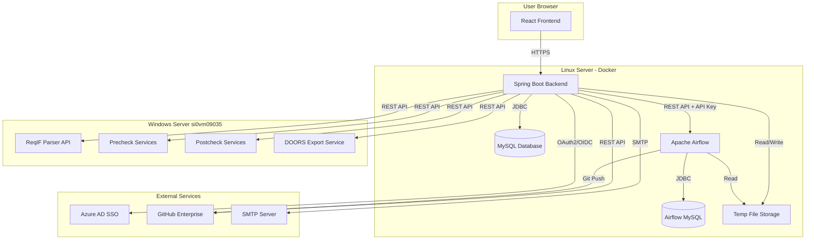
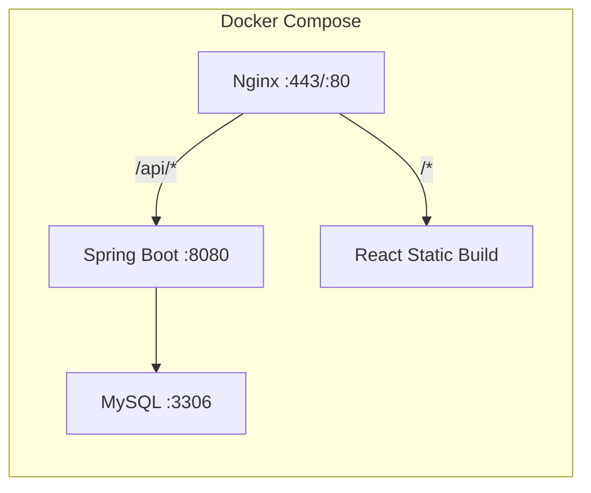
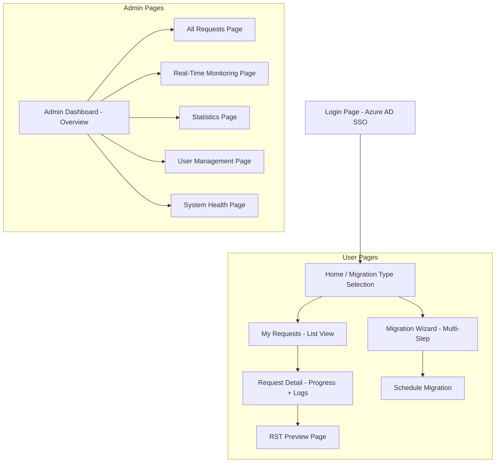
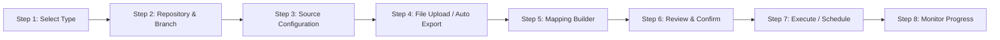
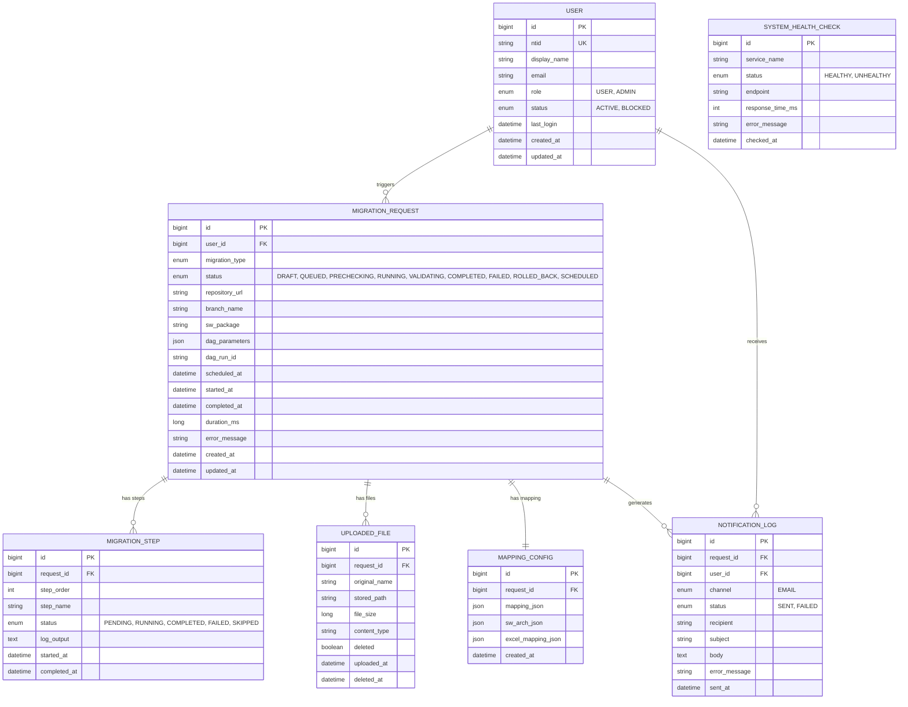
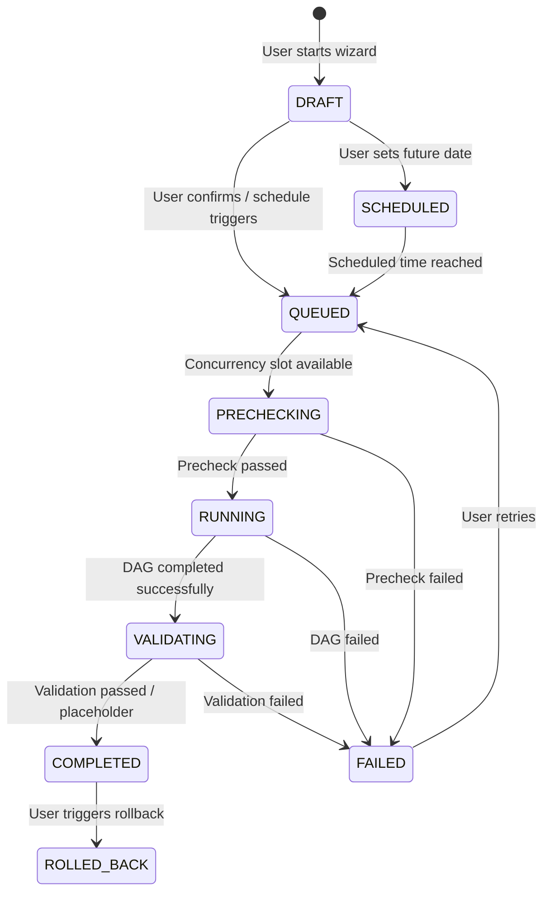

# DaC Migration Portal -- Full Requirements Specification

| Field           | Value                                    |
|-----------------|------------------------------------------|
| Document ID     | DaC-MIG-REQ-001                          |
| Version         | 1.0.0                                    |
| Date            | 2026-03-24                               |
| Author          | Truong Hoang Huy (MS/EET22)              |
| Status          | Draft                                    |
| Classification  | Bosch Internal                           |

---

## Table of Contents

1. [Introduction](#1-introduction)
2. [Stakeholders and Roles](#2-stakeholders-and-roles)
3. [System Architecture](#3-system-architecture)
4. [Functional Requirements](#4-functional-requirements)
5. [Migration Type Specifications](#5-migration-type-specifications)
6. [User Interface Requirements](#6-user-interface-requirements)
7. [Integration Requirements](#7-integration-requirements)
8. [Data Model](#8-data-model)
9. [Non-Functional Requirements](#9-non-functional-requirements)
10. [Security Requirements](#10-security-requirements)
11. [Deployment Requirements](#11-deployment-requirements)
12. [Decision Log](#12-decision-log)
13. [Assumptions](#13-assumptions)
14. [Open Items](#14-open-items)
15. [Glossary](#15-glossary)

---

## 1. Introduction

### 1.1 Purpose

This document specifies the complete requirements for the **DaC Migration Portal**, a unified web application that replaces the current manual, multi-step workaround process for migrating engineering artifacts from legacy tools into Doc-as-Code (DaC) repositories.

### 1.2 Problem Statement

Currently, engineers must perform 5-10 manual steps per migration, involving:
- Exporting data from DOORS/DNG/Rhapsody/SDOM manually
- Running curl commands against Airflow REST APIs
- Creating mapping JSON files by hand
- Executing DXL scripts on remote servers
- Manually setting up GitHub branches and directory structures

This process is error-prone, time-consuming, and requires deep technical knowledge of the toolchain.

### 1.3 Solution Overview

The DaC Migration Portal provides:
- A guided **wizard workflow** that walks users through each migration step
- **Automated orchestration** of existing Windows server APIs and Airflow DAGs
- A **visual mapping builder** to replace manual JSON editing
- **Real-time monitoring** of migration progress with retry capability
- An **admin dashboard** for oversight, statistics, and user management

### 1.4 Scope

**In Scope (V1):**
- All 7 migration types (see Section 5)
- SSO authentication via Bosch Azure AD
- User and Admin roles
- Wizard-based migration workflow
- GitHub repository browsing and branch creation
- File upload for DNG/Rhapsody/TestSpec migrations
- Visual mapping configuration UI
- Step-by-step progress monitoring with logs
- Retry failed migrations
- RST preview (rendered HTML + raw syntax-highlighted)
- Migration rollback (revert entire migration commits)
- Scheduled migrations (future date/time)
- Email notifications on completion/failure
- Admin dashboard with drill-down pages
- Post-migration validation placeholder (hook for future services)

**Out of Scope:**
- Multi-tenant support (isolated departments)
- Mobile-responsive design / mobile app
- Editing RST files within the web app (preview only)

---

## 2. Stakeholders and Roles

### 2.1 Application Roles

| Role | Description | Permissions |
|------|-------------|-------------|
| **User** | Engineers who trigger migrations | Create migration requests, upload files, configure mappings, monitor own requests, retry own failed migrations, view own history, rollback own migrations |
| **Admin** | Team leads / tool administrators | All User permissions + view all requests, monitor all DAGs, view statistics, manage users (approve/block/assign roles), view system health, configure system settings |

### 2.2 System Actors

| Actor | Description |
|-------|-------------|
| **Web Application** | Spring Boot backend + React frontend |
| **Airflow Server** | Executes migration DAGs on Linux server |
| **Windows Server** | Hosts precheck, postcheck, ReqIF parser, and DOORS export services |
| **GitHub Enterprise** | Target repositories at github.boschdevcloud.com |
| **Azure AD** | Bosch Microsoft AAD for SSO authentication |
| **MySQL Database** | Stores application data (new dedicated instance) |
| **SMTP Server** | Sends email notifications (TBD) |

---

## 3. System Architecture

### 3.1 High-Level Architecture



### 3.2 Technology Stack

| Layer | Technology | Version | Notes |
|-------|-----------|---------|-------|
| Frontend | React | 18+ | TypeScript, Ant Design or MUI |
| Backend | Spring Boot | 3.x | Java 17+ |
| Auth | Spring Security + OAuth2 | - | Azure AD OIDC |
| Database | MySQL | 8.x | New dedicated instance |
| ORM | Spring Data JPA / Hibernate | - | |
| API Docs | SpringDoc OpenAPI | - | Swagger UI |
| Build | Maven or Gradle | - | |
| Container | Docker + Docker Compose | - | |
| Reverse Proxy | Nginx | - | Serves frontend, proxies API |

### 3.3 Container Architecture



---

## 4. Functional Requirements

### 4.1 Authentication & Authorization

| ID | Requirement | Priority |
|----|------------|----------|
| AUTH-001 | Users shall authenticate via Bosch Azure AD (Microsoft AAD) using OAuth2/OIDC | Must |
| AUTH-002 | A new Azure App Registration shall be created for this application | Must |
| AUTH-003 | The system shall support two roles: User and Admin | Must |
| AUTH-004 | Admin can assign/change user roles via the user management page | Must |
| AUTH-005 | Admin can block/unblock user accounts | Must |
| AUTH-006 | Session timeout shall be configurable (default: 8 hours) | Should |
| AUTH-007 | The system shall display the logged-in user's name and role in the header | Must |

### 4.2 Migration Wizard

| ID | Requirement | Priority |
|----|------------|----------|
| WIZ-001 | The wizard shall present all 7 migration types with recommended execution order | Must |
| WIZ-002 | Users may select any migration type independently (order is recommended, not enforced) | Must |
| WIZ-003 | The wizard shall guide users step-by-step through: source configuration, file upload/auto-export, mapping configuration, pre-checks, migration trigger, monitoring | Must |
| WIZ-004 | Each wizard step shall validate inputs before allowing progression to the next step | Must |
| WIZ-005 | Users shall be able to navigate back to previous wizard steps to modify inputs | Must |
| WIZ-006 | The wizard shall display contextual help/tooltips for each input field | Should |
| WIZ-007 | The wizard shall save draft state so users can resume an incomplete wizard later | Should |

### 4.3 GitHub Repository Management

| ID | Requirement | Priority |
|----|------------|----------|
| GH-001 | Users shall be able to browse available GitHub repositories via the GitHub Enterprise API | Must |
| GH-002 | Users shall be able to manually type a repository URL as an alternative to browsing | Must |
| GH-003 | The system shall list existing branches for a selected repository | Must |
| GH-004 | The system shall create new branches automatically when requested by the user | Must |
| GH-005 | The system shall use a shared GitHub service account for all API operations | Must |
| GH-006 | The system shall validate that the repository URL is accessible before proceeding | Must |

### 4.4 File Upload (DNG/Rhapsody/TestSpec Migrations)

| ID | Requirement | Priority |
|----|------------|----------|
| FILE-001 | The system shall accept file uploads up to 50MB per file | Must |
| FILE-002 | Accepted file types: .reqif, .reqifz, .xlsx, .xlsm, .json, .csv, .png, .jpg, .rtf | Must |
| FILE-003 | The system shall support batch upload (multiple files at once) | Must |
| FILE-004 | Uploaded files shall be stored temporarily on the Linux server in an Airflow-accessible directory | Must |
| FILE-005 | Uploaded files shall be automatically deleted after migration completes (success or failure) | Must |
| FILE-006 | The system shall show upload progress and file validation status | Must |
| FILE-007 | The system shall validate file format and size before accepting the upload | Must |

### 4.5 Visual Mapping Builder

| ID | Requirement | Priority |
|----|------------|----------|
| MAP-001 | After file upload or ReqIF parsing, the system shall display a table/form UI for users to build the module-to-directory mapping | Must |
| MAP-002 | The mapping UI shall show parsed module names (from ReqIF JSON or Excel) as source values | Must |
| MAP-003 | Users shall be able to set the target GitHub directory for each module | Must |
| MAP-004 | For DNG-based migrations, the mapping shall support two values per module: git path and RST file prefix | Must |
| MAP-005 | For DOORS-based requirement migrations, the system shall also support sw_arch.json configuration (module name to SWARCH DaC ID) | Must |
| MAP-006 | The system shall validate that all modules have a mapping before allowing the migration to proceed | Must |
| MAP-007 | Users shall be able to export the mapping as JSON for reference | Should |
| MAP-008 | Users shall be able to import a previously exported mapping JSON | Should |

### 4.6 Migration Execution & Monitoring

| ID | Requirement | Priority |
|----|------------|----------|
| MIG-001 | The system shall trigger the appropriate Airflow DAG via REST API with the correct parameters | Must |
| MIG-002 | The system shall call Windows server precheck APIs before triggering migration (where applicable) | Must |
| MIG-003 | The system shall poll Airflow DAG run status and display step-by-step progress | Must |
| MIG-004 | The system shall display Airflow task logs for each step (accessible to the user) | Must |
| MIG-005 | The system shall support a maximum of 3-5 concurrent DAG runs (configurable) | Must |
| MIG-006 | Migrations exceeding the concurrency limit shall be queued | Must |
| MIG-007 | Users shall be able to retry a failed migration from the monitoring view | Must |
| MIG-008 | The system shall record the start time, end time, duration, and final status of each migration | Must |
| MIG-009 | The system shall call post-migration validation placeholder (hook for future services) | Must |
| MIG-010 | The system shall support scheduling a migration for a future date/time | Must |

### 4.7 RST Preview

| ID | Requirement | Priority |
|----|------------|----------|
| RST-001 | After a successful migration, users shall be able to preview generated RST files | Must |
| RST-002 | The preview shall support rendered HTML view (RST -> HTML rendering) | Must |
| RST-003 | The preview shall support raw RST with syntax highlighting | Must |
| RST-004 | Users shall be able to toggle between rendered and raw views | Must |
| RST-005 | The preview is read-only (no editing capability) | Must |

### 4.8 Migration Rollback

| ID | Requirement | Priority |
|----|------------|----------|
| ROLL-001 | Users shall be able to rollback a completed migration | Must |
| ROLL-002 | Rollback shall revert the entire migration (all Git commits from that DAG run) | Must |
| ROLL-003 | The system shall create a revert commit (not force-push) for traceability | Must |
| ROLL-004 | The system shall confirm the rollback action with the user before executing | Must |
| ROLL-005 | Rollback status shall be recorded and visible in migration history | Must |

### 4.9 Notifications

| ID | Requirement | Priority |
|----|------------|----------|
| NOTIF-001 | The system shall send an email notification when a migration completes successfully | Must |
| NOTIF-002 | The system shall send an email notification when a migration fails | Must |
| NOTIF-003 | Email shall include: migration type, repository, branch, status, duration, and a link to the migration details page | Must |
| NOTIF-004 | Email shall be sent to the user who triggered the migration | Must |
| NOTIF-005 | SMTP server configuration shall be externalized (configurable without code change) | Must |
| NOTIF-006 | If SMTP is unavailable, the system shall log the notification failure but not block the migration flow | Must |

### 4.10 User Dashboard (User Role)

| ID | Requirement | Priority |
|----|------------|----------|
| UDASH-001 | Users shall see a list of their own migration requests with status | Must |
| UDASH-002 | Users shall be able to filter requests by: migration type, status, date range | Must |
| UDASH-003 | Users shall be able to search requests by repository name or branch | Should |
| UDASH-004 | Users shall see a summary card showing: total migrations, running, completed, failed | Must |
| UDASH-005 | Clicking a migration request shall open the detail view with progress, logs, and actions | Must |

### 4.11 Admin Dashboard

| ID | Requirement | Priority |
|----|------------|----------|
| ADASH-001 | Admin dashboard overview page shall show summary cards for: total requests, active migrations, success rate, system health status | Must |
| ADASH-002 | Clicking each summary area shall navigate to a dedicated detail page | Must |

#### 4.11.1 All Requests Page

| ID | Requirement | Priority |
|----|------------|----------|
| ADASH-010 | Admin shall see all migration requests from all users | Must |
| ADASH-011 | Admin shall be able to filter by: user, migration type, status, date range | Must |
| ADASH-012 | Admin shall be able to sort by any column | Must |
| ADASH-013 | Admin shall be able to export request data as CSV | Should |

#### 4.11.2 Real-Time Monitoring Page

| ID | Requirement | Priority |
|----|------------|----------|
| ADASH-020 | Admin shall see currently running Airflow DAG executions with real-time status | Must |
| ADASH-021 | Admin shall be able to view task-level status and logs for any running DAG | Must |
| ADASH-022 | Admin shall see the migration queue (pending migrations waiting for a concurrency slot) | Must |

#### 4.11.3 Statistics Page

| ID | Requirement | Priority |
|----|------------|----------|
| ADASH-030 | Admin shall see charts showing: migrations per day/week/month | Must |
| ADASH-031 | Admin shall see success/failure rate over time | Must |
| ADASH-032 | Admin shall see breakdown by migration type | Must |
| ADASH-033 | Admin shall see most active users | Must |
| ADASH-034 | Admin shall be able to select date range for all charts | Must |

#### 4.11.4 User Management Page

| ID | Requirement | Priority |
|----|------------|----------|
| ADASH-040 | Admin shall see a list of all registered users | Must |
| ADASH-041 | Admin shall be able to assign/change role (User/Admin) | Must |
| ADASH-042 | Admin shall be able to block/unblock users | Must |
| ADASH-043 | Admin shall see each user's last login time and total migration count | Should |

#### 4.11.5 System Health Page

| ID | Requirement | Priority |
|----|------------|----------|
| ADASH-050 | Admin shall see the health status of: Airflow server, Windows server APIs, GitHub Enterprise API, MySQL database, SMTP server | Must |
| ADASH-051 | The system shall perform periodic health checks (configurable interval, default: 60 seconds) | Must |
| ADASH-052 | Unhealthy services shall be highlighted in red with the last error message | Must |
| ADASH-053 | Admin shall be able to trigger a manual health check | Should |

---

## 5. Migration Type Specifications

### 5.1 Overview

| # | Migration Type | DAG Name | Source Tool | Export Mode | Data Directory |
|---|---------------|----------|-------------|-------------|----------------|
| 1 | SW Architecture | `sw_arch_element2dac` | Excel Template | User fills template in UI | `data/sw_arch_element/` |
| 2 | DOORS Requirements | `doors_migration` | DOORS (ReqIF) | **Automated** via Windows APIs | `data/requirements/<SwPkg>/` |
| 3 | DNG Requirements | `dng2dac` | DNG (ReqIF) | **Manual upload** | `data/requirements/<SwPkg>/` |
| 4 | DOORS DSD | `dsd2dac` | DOORS (ReqIF) | **Automated** via Windows APIs | `data/detailed_software_design/<SwPkg>/` |
| 5 | DNG DSD | `dng2dac_dsd` | DNG (ReqIF) | **Manual upload** | `data/detailed_software_designs/<SwPkg>/` |
| 6 | Rhapsody DSD | `rhapsody2dac` | Rhapsody (SDOM) | **Manual upload** | `data/rhapsody/<SwPkg>/` |
| 7 | TestSpec | `test_spec2dac` | Excel (SDOM) | **Manual upload** | `data/excel/<SwPkg>/` |

**Recommended execution order:** 1 -> 2/3 -> 4/5/6 -> 7 (not enforced).

### 5.2 Type 1: SW Architecture (SwArchElement2DaC)

**Wizard Steps:**
1. Select/create GitHub repository and branch
2. Enter SW Package name (`SwPkg`)
3. Fill SW Architecture Element template in web UI (or upload pre-filled `.xlsx`)
4. Review and confirm
5. Trigger DAG `sw_arch_element2dac`
6. Monitor progress

**Airflow DAG Parameters:**
```json
{
  "conf": {
    "repositoryUrl": "<github_repo_url>",
    "branch": "<branch_name>",
    "SwPkg": "<sw_package_name>"
  }
}
```

**Template Fields:** need_type, title, element_class (SwArchPkg/SwArchSubPkg/SwArchCpt), long_name_en, responsible, proxy_responsible, supplier, safety_classification, implements, sw_arch_clearing_id, exported_interfaces, imported_interfaces, description, parent_element, parent_element_class, dir.

### 5.3 Type 2: DOORS Requirements (DOORs2DaC)

**Export Mode:** Automated -- web app calls Windows server services.

**Wizard Steps:**
1. Select/create GitHub repository and branch
2. Enter SW Package name (`SwPkg`)
3. Provide DOORS module information (Module Name, DOORS path, baseline version)
4. System calls Windows service to export ReqIF from DOORS
5. System calls ReqIF Parser API to convert ReqIF to JSON
6. System presents parsed module names -> user builds mapping in visual UI (`mapping.json`)
7. User configures `sw_arch.json` (module name -> SWARCH DaC ID)
8. System calls Windows service to export linking information (input.csv -> output.csv)
9. Call precheck service
10. Trigger DAG `doors_migration`
11. Monitor progress
12. Post-migration validation placeholder

**Airflow DAG Parameters:**
```json
{
  "conf": {
    "repositoryUrl": "<github_repo_url>",
    "branch": "<branch_name>",
    "SwPkg": "<sw_package_name>"
  }
}
```

**Required Data Structure on Server:**
```
<SwPkg>/
├── json/              (parsed ReqIF -> JSON)
├── linking/
│   ├── input.csv      (DOORS module paths + baseline versions)
│   └── output.csv     (linking information from DXL export)
├── mapping.json       (module name -> GitHub directory)
├── sw_arch.json       (module name -> SWARCH DaC ID)
└── reqif/             (exported ReqIF files + embedded images)
```

**Post-Migration Known Issues:**
- Missing links: `REQ_000000000000` placeholder where `satisfies` links are missing
- `satisfies_dng` needs renaming to `satisfies`
- Text followed by underscore (e.g., `BI_`) needs backslash escaping (`BI\_`)
- `needextend` parts in `requirement.rst` under 'Sub Requirement' may need removal

### 5.4 Type 3: DNG Requirements (DNG2DaC)

**Export Mode:** Manual -- user exports ReqIF from DNG and uploads.

**Wizard Steps:**
1. Select/create GitHub repository and branch
2. Enter SW Package name (`SwPkg`)
3. Provide DNG module URLs (`moduleUrls`) and context URL (`contextUrl`)
4. Upload exported ReqIF file(s)
5. System calls ReqIF Parser API to convert ReqIF to JSON
6. System presents parsed module names -> user builds mapping in visual UI
   - mapping.json format: `{"module_name": ["git_path", "rst_prefix"]}`
7. User configures `sw_arch.json`
8. Call precheck service
9. Trigger DAG `dng2dac`
10. Monitor progress

**Airflow DAG Parameters:**
```json
{
  "conf": {
    "repositoryUrl": "<github_repo_url>",
    "moduleUrls": ["<dng_module_url_1>", "<dng_module_url_2>"],
    "contextUrl": "<gc_configuration_url>",
    "branch": "<branch_name>",
    "SwPkg": "<sw_package_name>"
  }
}
```

**Required Data Structure on Server:**
```
<SwPkg>/
├── json/              (parsed ReqIF -> JSON)
├── mapping.json       (module name -> [git_path, rst_prefix])
├── sw_arch.json       (module name -> SWARCH DaC ID)
└── reqif/             (uploaded ReqIF files + images)
```

### 5.5 Type 4: DOORS Detailed SW Design (DOORs2DaC DSD)

**Export Mode:** Automated -- web app calls Windows server services.

**Wizard Steps:**
1. Select/create GitHub repository and branch
2. Enter SW Package name (`SwPkg`)
3. Provide DOORS module information (Module Name, DOORS path, baseline version)
4. System calls Windows service to export ReqIF from DOORS
5. System calls ReqIF Parser API to convert ReqIF to JSON
6. System presents parsed module names -> user builds mapping in visual UI
   - mapping.json format: `{"module_name": "git_path"}`
7. System calls Windows service to export linking information
8. Call precheck service
9. Trigger DAG `dsd2dac`
10. Monitor progress

**Airflow DAG Parameters:**
```json
{
  "conf": {
    "repositoryUrl": "<github_repo_url>",
    "branch": "<branch_name>",
    "SwPkg": "<sw_package_name>"
  }
}
```

**Required Data Structure on Server:**
```
<SwPkg>/
├── json/              (parsed ReqIF -> JSON)
├── linking/
│   ├── input.csv
│   └── output.csv
├── mapping.json       (module name -> GitHub directory)
└── reqif/             (exported ReqIF files + images)
```

### 5.6 Type 5: DNG Detailed SW Design (DNG2DaC DSD)

**Export Mode:** Manual -- user exports ReqIF from DNG and uploads.

**Wizard Steps:**
1. Select/create GitHub repository and branch
2. Enter SW Package name (`SwPkg`)
3. Provide DNG module URLs (`moduleUrls`) and context URL (`contextUrl`)
4. Upload exported ReqIF file(s)
5. System calls ReqIF Parser API to convert ReqIF to JSON
6. System presents parsed module names -> user builds mapping in visual UI
   - mapping.json format: `{"module_name": ["git_path", "rst_prefix"]}`
7. Call precheck service
8. Trigger DAG `dng2dac_dsd`
9. Monitor progress

**Airflow DAG Parameters:**
```json
{
  "conf": {
    "repositoryUrl": "<github_repo_url>",
    "moduleUrls": ["<dng_module_url_1>"],
    "contextUrl": "<gc_configuration_url>",
    "branch": "<branch_name>",
    "SwPkg": "<sw_package_name>"
  }
}
```

**Required Data Structure on Server:**
```
<SwPkg>/
├── json/              (parsed ReqIF -> JSON)
├── mapping.json       (module name -> [git_path, rst_prefix])
└── reqif/             (uploaded ReqIF files + images)
```

### 5.7 Type 6: Rhapsody Detailed SW Design (Rhapsody2DaC)

**Export Mode:** Manual -- user exports Rhapsody project from SDOM and uploads.

**Wizard Steps:**
1. Select/create GitHub repository and branch
2. Enter SW Package name (`SwPkg`)
3. Provide module list (Module Name, Target Folder, Rhapsody Version on SDOM)
4. Upload exported Rhapsody JSON and image files per module
5. System lists module names from parsed JSON (`project_Data` key, type `Package`)
6. User builds mapping in visual UI
   - mapping.json format: `{"module_name": "git_path"}`
7. Call precheck service
8. Trigger DAG `rhapsody2dac`
9. Monitor progress

**Airflow DAG Parameters:**
```json
{
  "conf": {
    "repositoryUrl": "<github_repo_url>",
    "branch": "<branch_name>",
    "SwPkg": "<sw_package_name>"
  }
}
```

**Required Data Structure on Server:**
```
<SwPkg>/
├── module1/
│   ├── json/          (Rhapsody exported JSON)
│   └── images/        (diagram images)
├── module2/
│   ├── json/
│   └── images/
└── mapping.json       (module name -> GitHub directory)
```

### 5.8 Type 7: Test Specification (TestSpec2DaC)

**Export Mode:** Manual -- user uploads Excel files from SDOM.

**Wizard Steps:**
1. Select/create GitHub repository and branch
2. Enter Excel directory name (`excelDirName`)
3. Provide module list (Module Name, Target Folder, UT/SWQT/SYSQT Spec Versions)
4. Upload test specification Excel files (.xlsm)
5. System presents modules -> user builds mapping in visual UI
   - excel_mapping format: `{"target_dir": ["module_ut_spec.xlsm", "module_swqt_spec.xlsm"]}`
6. Call precheck service
7. Trigger DAG `test_spec2dac`
8. Monitor progress

**Airflow DAG Parameters:**
```json
{
  "conf": {
    "repositoryUrl": "<github_repo_url>",
    "branch": "<branch_name>",
    "excelDirName": "<excel_directory_name>"
  }
}
```

**Supported ProcLib Templates:** SWQT, UT, ECU-System Test, SFT, URT, SysQT.

**Required Data Structure on Server:**
```
data/excel/<excelDirName>/
├── module1_ut_spec.xlsm
├── module1_swqt_spec.xlsm
├── module2_ut_spec.xlsm
└── ...

data/excel_mapping/<excelDirName>.json
```

**Post-Migration Known Issues:**
- Missing links in `verified_artifact`: `REQ_000000000000` placeholder for SWQT, `DESIGN_000000000000` for UT
- Text followed by underscore needs backslash escaping

---

## 6. User Interface Requirements

### 6.1 Page Structure



### 6.2 Navigation Layout

| Element | Description |
|---------|-------------|
| **Header** | App logo, app name, logged-in user name + role, logout button |
| **Left Sidebar** | Navigation menu: Home, New Migration, My Requests, (Admin section if admin) |
| **Main Content** | Context-dependent content area |
| **Footer** | Version number, copyright Bosch |

### 6.3 Wizard UI Flow (per migration type)



### 6.4 Key UI Components

| Component | Description |
|-----------|-------------|
| **Migration Type Cards** | 7 cards with icon, title, description, recommended order badge |
| **Repository Selector** | Combo box with GitHub API autocomplete + manual URL input |
| **Branch Selector** | Dropdown listing existing branches + "Create New" option |
| **File Upload Zone** | Drag-and-drop area with progress bars, file type validation |
| **Mapping Builder Table** | Editable table: source module name (read-only) -> target fields (editable) |
| **Progress Tracker** | Vertical stepper showing: Queued -> Prechecking -> Running -> Validating -> Complete |
| **Log Viewer** | Scrollable, searchable log output panel with auto-scroll |
| **RST Preview Panel** | Split view: rendered HTML on left, raw RST on right, toggle button |
| **Statistics Charts** | Bar charts, line charts, pie charts (use a React charting library) |

---

## 7. Integration Requirements

### 7.1 Airflow REST API

| ID | Requirement | Details |
|----|------------|---------|
| INT-AF-001 | Authentication | API Key (to be configured in Airflow) |
| INT-AF-002 | Trigger DAG | `POST /api/v1/dags/{dag_id}/dagRuns` with `conf` JSON body |
| INT-AF-003 | Get DAG Run Status | `GET /api/v1/dags/{dag_id}/dagRuns/{dag_run_id}` |
| INT-AF-004 | Get Task Instances | `GET /api/v1/dags/{dag_id}/dagRuns/{dag_run_id}/taskInstances` |
| INT-AF-005 | Get Task Logs | `GET /api/v1/dags/{dag_id}/dagRuns/{dag_run_id}/taskInstances/{task_id}/logs/{try_number}` |
| INT-AF-006 | Airflow Base URL | Configurable (default: `http://localhost:8080`) |

**DAG Name Registry:**

| Migration Type | DAG ID |
|---------------|--------|
| SW Architecture | `sw_arch_element2dac` |
| DOORS Requirements | `doors_migration` |
| DNG Requirements | `dng2dac` |
| DOORS DSD | `dsd2dac` |
| DNG DSD | `dng2dac_dsd` |
| Rhapsody DSD | `rhapsody2dac` |
| TestSpec | `test_spec2dac` |

### 7.2 Windows Server REST APIs

| ID | Service | Endpoint (Base: si0vm09035.de.bosch.com) | Method |
|----|---------|------------------------------------------|--------|
| INT-WIN-001 | ReqIF Parser | `/migration/api/reqif/api/v1/reqif/parse-file` | POST (multipart/form-data) |
| INT-WIN-002 | Precheck (Requirements) | TBD | TBD |
| INT-WIN-003 | Precheck (TestSpec) | TBD | TBD |
| INT-WIN-004 | Postcheck (Requirements) | TBD | TBD |
| INT-WIN-005 | Postcheck (TestSpec) | TBD | TBD |
| INT-WIN-006 | DOORS ReqIF Export | TBD | TBD |
| INT-WIN-007 | DOORS Linking Export | TBD | TBD |

> **Note:** Endpoints marked TBD will be documented during implementation. The integration layer shall use an abstraction (interface/adapter pattern) so API details can be plugged in without rewriting business logic.

### 7.3 GitHub Enterprise API

| ID | Operation | Endpoint |
|----|-----------|----------|
| INT-GH-001 | List user repositories | `GET /api/v3/user/repos` |
| INT-GH-002 | Search repositories | `GET /api/v3/search/repositories?q=...` |
| INT-GH-003 | List branches | `GET /api/v3/repos/{owner}/{repo}/branches` |
| INT-GH-004 | Create branch | `POST /api/v3/repos/{owner}/{repo}/git/refs` |
| INT-GH-005 | Get commit SHA | `GET /api/v3/repos/{owner}/{repo}/git/refs/heads/{branch}` |
| INT-GH-006 | Revert commit (rollback) | `POST /api/v3/repos/{owner}/{repo}/merges` or Git revert via API |
| INT-GH-007 | Browse file tree (RST preview) | `GET /api/v3/repos/{owner}/{repo}/contents/{path}?ref={branch}` |

**Authentication:** Personal Access Token (PAT) from shared service account, stored securely in application configuration.

### 7.4 Azure AD (OAuth2/OIDC)

| ID | Requirement |
|----|------------|
| INT-AAD-001 | Register a new Azure App in Bosch Microsoft_AAD_RegisteredApps |
| INT-AAD-002 | Configure redirect URI to `https://<app-domain>/login/oauth2/code/azure` |
| INT-AAD-003 | Request scopes: `openid`, `profile`, `email` |
| INT-AAD-004 | Extract user info: display name, email, employee ID from ID token claims |
| INT-AAD-005 | Use Spring Security OAuth2 Client for integration |

### 7.5 Email (SMTP)

| ID | Requirement |
|----|------------|
| INT-SMTP-001 | SMTP host, port, auth credentials shall be externalized in application config |
| INT-SMTP-002 | Use Spring Boot Mail Starter for email sending |
| INT-SMTP-003 | Email templates shall be HTML-based (Thymeleaf templates) |
| INT-SMTP-004 | Fallback: log notification to database if SMTP is unavailable |

---

## 8. Data Model

### 8.1 Entity Relationship Diagram



### 8.2 Migration Status State Machine



### 8.3 Enum Definitions

**MigrationType:**
```
SW_ARCHITECTURE, DOORS_REQUIREMENT, DNG_REQUIREMENT, DOORS_DSD, DNG_DSD, RHAPSODY_DSD, TEST_SPEC
```

**UserRole:**
```
USER, ADMIN
```

**UserStatus:**
```
ACTIVE, BLOCKED
```

**MigrationStatus:**
```
DRAFT, SCHEDULED, QUEUED, PRECHECKING, RUNNING, VALIDATING, COMPLETED, FAILED, ROLLED_BACK
```

**MigrationStepStatus:**
```
PENDING, RUNNING, COMPLETED, FAILED, SKIPPED
```

---

## 9. Non-Functional Requirements

### 9.1 Performance

| ID | Requirement |
|----|------------|
| NFR-PERF-001 | Page load time shall be < 3 seconds |
| NFR-PERF-002 | API response time for CRUD operations shall be < 500ms |
| NFR-PERF-003 | File upload shall support up to 50MB with progress indication |
| NFR-PERF-004 | Dashboard shall load within 5 seconds including chart rendering |
| NFR-PERF-005 | DAG status polling interval: 5-10 seconds (configurable) |

### 9.2 Scalability

| ID | Requirement |
|----|------------|
| NFR-SCALE-001 | Support 50-100 concurrent users |
| NFR-SCALE-002 | Support 3-5 concurrent DAG executions (configurable) |
| NFR-SCALE-003 | Support several migrations per day |
| NFR-SCALE-004 | Database shall handle 10,000+ migration records without degradation |

### 9.3 Availability

| ID | Requirement |
|----|------------|
| NFR-AVAIL-001 | High availability: 24/7 operation with minimal planned downtime |
| NFR-AVAIL-002 | Docker health checks shall auto-restart failed containers |
| NFR-AVAIL-003 | Graceful degradation: if Windows server is down, manual-upload migration types still work |

### 9.4 Maintainability

| ID | Requirement |
|----|------------|
| NFR-MAINT-001 | Externalized configuration (Spring profiles, environment variables) |
| NFR-MAINT-002 | Structured logging (JSON format) with correlation IDs per request |
| NFR-MAINT-003 | API versioning (`/api/v1/...`) |
| NFR-MAINT-004 | Database migrations managed via Flyway or Liquibase |
| NFR-MAINT-005 | Integration layer uses adapter/interface pattern for Windows server APIs |

### 9.5 Testability

| ID | Requirement |
|----|------------|
| NFR-TEST-001 | Unit test coverage >= 80% for backend business logic |
| NFR-TEST-002 | Integration tests for all external API integrations (using WireMock/MockServer) |
| NFR-TEST-003 | End-to-end tests for critical wizard flows |

---

## 10. Security Requirements

| ID | Requirement |
|----|------------|
| SEC-001 | All communication over HTTPS (TLS 1.2+) |
| SEC-002 | Authentication via Bosch Azure AD -- no local password storage |
| SEC-003 | Authorization enforced at API level (Spring Security annotations) |
| SEC-004 | CSRF protection enabled for all state-changing operations |
| SEC-005 | File upload validation: type whitelist, size limit, virus scan if available |
| SEC-006 | Sensitive configuration (API keys, PAT, DB credentials) stored in environment variables or a vault, never in source code |
| SEC-007 | SQL injection prevention via parameterized queries (JPA/Hibernate) |
| SEC-008 | XSS prevention via React's default escaping + Content Security Policy headers |
| SEC-009 | Audit logging: all migration triggers, rollbacks, and admin actions logged with user ID and timestamp |
| SEC-010 | Temporary uploaded files stored outside the web root with randomized filenames |
| SEC-011 | Intranet-only access (Bosch internal network) |

---

## 11. Deployment Requirements

### 11.1 Docker Compose Structure

```yaml
# Conceptual structure
services:
  nginx:
    image: nginx:alpine
    ports:
      - "443:443"
      - "80:80"
    depends_on:
      - backend
      - frontend

  frontend:
    build: ./frontend
    # React production build served by Nginx

  backend:
    build: ./backend
    environment:
      - SPRING_PROFILES_ACTIVE=prod
      - DB_HOST=mysql
      - DB_NAME=dac_migration
      - AIRFLOW_BASE_URL=http://airflow:8080
      - AIRFLOW_API_KEY=${AIRFLOW_API_KEY}
      - AZURE_CLIENT_ID=${AZURE_CLIENT_ID}
      - AZURE_CLIENT_SECRET=${AZURE_CLIENT_SECRET}
      - AZURE_TENANT_ID=${AZURE_TENANT_ID}
      - GITHUB_PAT=${GITHUB_PAT}
      - SMTP_HOST=${SMTP_HOST}
    volumes:
      - upload-temp:/app/uploads
      - airflow-data:/opt/airflow/data
    depends_on:
      - mysql

  mysql:
    image: mysql:8
    environment:
      - MYSQL_DATABASE=dac_migration
      - MYSQL_ROOT_PASSWORD=${MYSQL_ROOT_PASSWORD}
    volumes:
      - mysql-data:/var/lib/mysql

volumes:
  upload-temp:
  airflow-data:
  mysql-data:
```

### 11.2 Shared Volume for Airflow

The backend writes uploaded/generated files to a shared volume that Airflow can read. The directory structure must match what each DAG expects (see Section 5).

### 11.3 Environment Configuration

| Variable | Description | Required |
|----------|-------------|----------|
| `AZURE_CLIENT_ID` | Azure App Registration client ID | Yes |
| `AZURE_CLIENT_SECRET` | Azure App Registration secret | Yes |
| `AZURE_TENANT_ID` | Bosch Azure AD tenant ID | Yes |
| `DB_HOST` | MySQL hostname | Yes |
| `DB_PORT` | MySQL port (default: 3306) | No |
| `DB_NAME` | Database name | Yes |
| `DB_USERNAME` | Database username | Yes |
| `DB_PASSWORD` | Database password | Yes |
| `AIRFLOW_BASE_URL` | Airflow REST API base URL | Yes |
| `AIRFLOW_API_KEY` | Airflow API key | Yes |
| `GITHUB_PAT` | GitHub service account PAT | Yes |
| `GITHUB_BASE_URL` | GitHub Enterprise API URL | Yes |
| `WINDOWS_SERVER_BASE_URL` | Windows server API base URL | Yes |
| `SMTP_HOST` | SMTP server hostname | No (TBD) |
| `SMTP_PORT` | SMTP server port | No |
| `SMTP_USERNAME` | SMTP auth username | No |
| `SMTP_PASSWORD` | SMTP auth password | No |
| `UPLOAD_MAX_SIZE_MB` | Max upload size (default: 50) | No |
| `MAX_CONCURRENT_DAGS` | Max parallel DAG runs (default: 5) | No |
| `HEALTH_CHECK_INTERVAL_SEC` | Health check frequency (default: 60) | No |

---

## 12. Decision Log

| # | Decision | Alternatives Considered | Rationale |
|---|----------|------------------------|-----------|
| D-001 | **Java Spring Boot** for backend | Python FastAPI, Node.js NestJS | Team familiarity and enterprise Java ecosystem at Bosch |
| D-002 | **React** for frontend | Angular, Vue, Thymeleaf | Large ecosystem, component reusability, team preference |
| D-003 | **New MySQL instance** for app DB | Share Airflow MySQL, PostgreSQL | Isolation from Airflow data; MySQL consistency across stack |
| D-004 | **Shared GitHub service account** | Per-user OAuth tokens | Simplifies token management; all migrations use one account |
| D-005 | **API Key** for Airflow auth | Basic Auth, OAuth2 | More secure than Basic Auth; simpler than full OAuth2 for service-to-service |
| D-006 | **Temporary file storage on Linux server** | S3/MinIO, SharePoint | Simplicity; files only needed during migration; Airflow needs local access |
| D-007 | **Recommended order, not enforced** for migration types | Strict sequential enforcement | Some users only need specific migrations; flexibility is important |
| D-008 | **Visual mapping builder** instead of JSON upload | JSON file upload only, auto-generation | Eliminates error-prone manual JSON editing; better UX |
| D-009 | **Email notifications** | Teams, in-app only | Users already monitor Bosch email; most universal channel |
| D-010 | **Revert entire migration** for rollback | Per-module revert, force-push | Simpler implementation; consistent state; traceability via revert commit |
| D-011 | **Intranet only** access | VPN, public internet | All users are internal; simplifies security model |
| D-012 | **3-5 concurrent DAG limit** | Unlimited, queue-only | Balances resource usage with user experience |

---

## 13. Assumptions

| # | Assumption | Impact if Wrong |
|---|-----------|-----------------|
| A-001 | All Windows server APIs (precheck, postcheck, DOORS export, ReqIF parser) are reachable from the Linux server over the internal network | Integration will fail; need VPN or network routing changes |
| A-002 | Windows server API contracts will be documented during implementation | May delay integration; adapter pattern mitigates this |
| A-003 | GitHub Enterprise at github.boschdevcloud.com supports REST API v3 with PAT auth | Need to verify; may need GitHub App auth instead |
| A-004 | Airflow can be reconfigured to use API key auth without breaking existing DAGs | Need Airflow admin coordination |
| A-005 | A Bosch Azure AD App Registration can be created for this app | Need IT/security approval process |
| A-006 | SMTP relay is available for Bosch internal email | Email feature deferred if not available |
| A-007 | File uploads are typically < 50MB | Need to handle larger files if assumption is wrong |
| A-008 | The shared volume between the web app container and Airflow container is feasible via Docker volume mounts | May need NFS or similar if containers are on different hosts |
| A-009 | RST can be rendered to HTML server-side (e.g., using docutils or rst2html) | May need a Python sidecar service or use a JS-based RST renderer |
| A-010 | The 7 Airflow DAGs have stable API contracts (conf parameters won't change without notice) | Breaking changes could cause migration failures |

---

## 14. Open Items

| # | Item | Owner | Priority | Status |
|---|------|-------|----------|--------|
| O-001 | Document all Windows server REST API contracts (precheck, postcheck, DOORS export, linking export) | Huy / Windows Server Team | High | Open |
| O-002 | Determine Bosch SMTP server/relay for email notifications | Huy | Medium | Open |
| O-003 | Create Azure AD App Registration (client ID, tenant ID, secret) | Huy / IT Admin | High | Open |
| O-004 | Reconfigure Airflow to use API key authentication | Huy / Airflow Admin | High | Open |
| O-005 | Create GitHub service account and generate PAT | Huy | High | Open |
| O-006 | Verify network connectivity from Linux server to Windows server APIs | Huy / Network Team | High | Open |
| O-007 | Determine RST-to-HTML rendering approach (Python docutils vs JS library) | Dev Team | Medium | Open |
| O-008 | Define exact concurrency limit for DAG runs (3 or 5?) | Huy | Low | Open |
| O-009 | Determine SSL certificate provisioning for HTTPS | Huy / IT Admin | Medium | Open |

---

## 15. Glossary

| Term | Definition |
|------|-----------|
| **DaC** | Doc-as-Code -- approach to managing documentation in version-controlled repositories using plain text formats (RST) |
| **RST** | reStructuredText -- markup language used for DaC documentation |
| **DOORS** | IBM Rational DOORS -- requirements management tool |
| **DNG** | IBM DOORS Next Generation (also called IBM ELM/RM) |
| **ReqIF** | Requirements Interchange Format -- XML-based standard for exchanging requirements data |
| **DAG** | Directed Acyclic Graph -- Airflow workflow definition |
| **DSD** | Detailed Software Design |
| **SDOM** | Software Development Object Manager |
| **SwPkg** | Software Package -- a logical grouping of modules being migrated |
| **SWARCH** | Software Architecture element |
| **PAT** | Personal Access Token -- GitHub authentication credential |
| **SSO** | Single Sign-On |
| **OIDC** | OpenID Connect -- identity layer on top of OAuth2 |
| **ProcLib** | Process Library -- template definitions for test specifications |

---

*End of Document*
